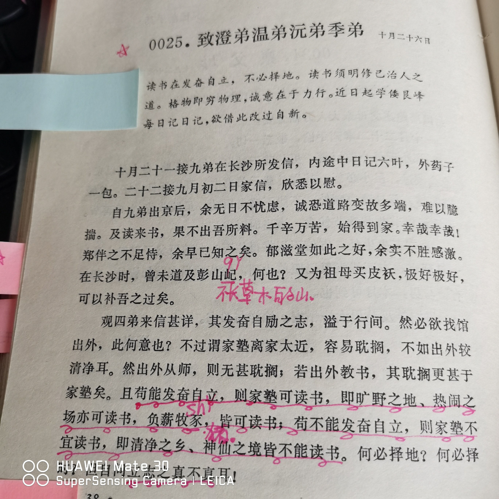
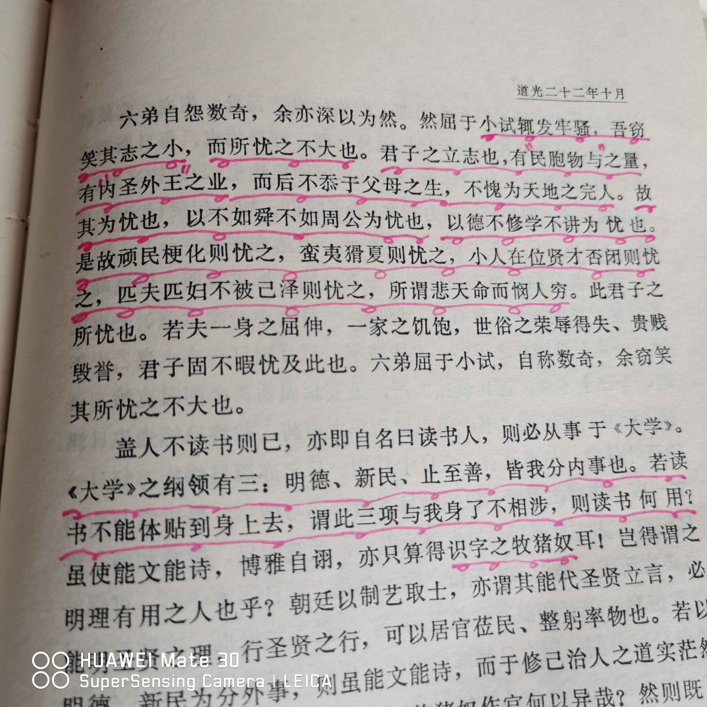
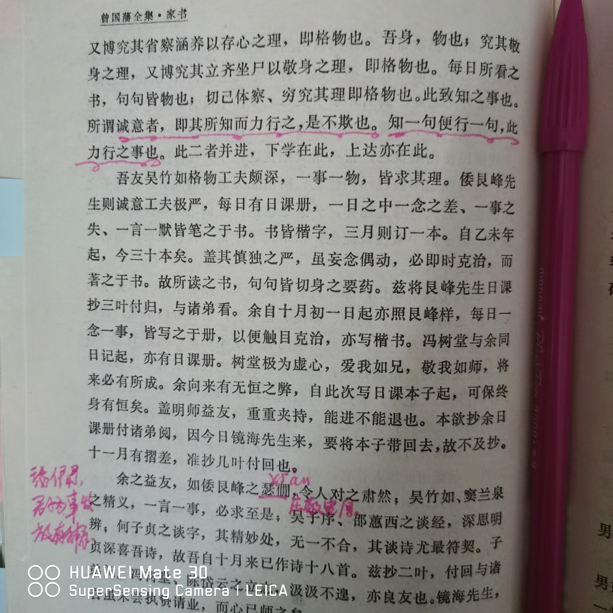
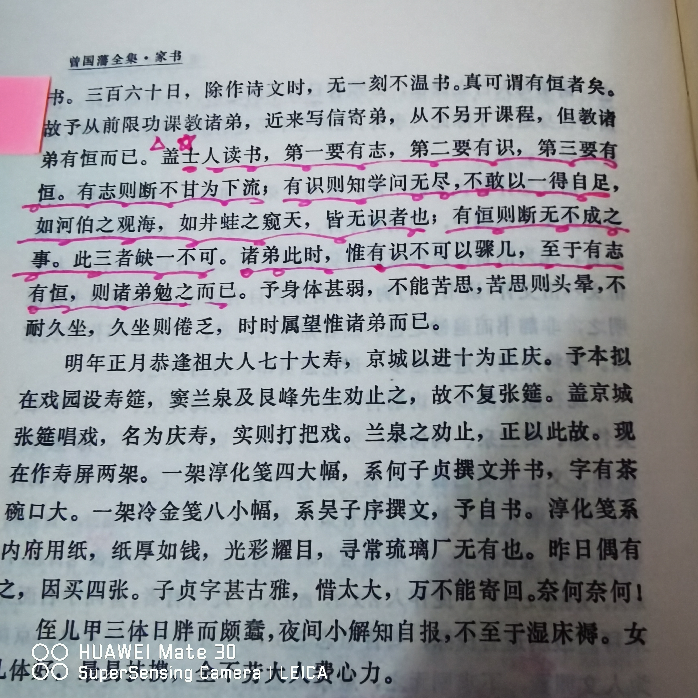

**道光二十二年十月二十六日 致澄弟温弟沅弟季弟**

> **苟能发奋自立，则家塾可读书，即旷野之地、热闹之场，亦可读书，负薪牧豕，皆可读书。苟不能发奋自立，则家塾不宜读书，即清净之乡、神仙之境，皆不能读书。何必择地，何必择时，但自问立志之真不真耳。**

评：

我们是不是也常会说，这个地方太吵闹了，我学习起来静不下心，需要去一个别的地方呢？

这也是人之常情。曾国藩的弟弟就是这样给大哥抱怨的。曾国藩是一顿猛批。如果你立志要读书了，在哪里都能读书；不立志读书，那怕是清净的神仙居所你也不能读书。

读书不必择时择地，你首先需要进行自我审视，我是不是要真心要读书。心态摆正了，捧起来书本读就是了。

读书，何尝不是修炼心态的一个过程呢？

------

> **屈于小试，辄发牢骚，吾窃笑其志之小而所忧之不大也。君子之立志也，有民胞物与之量，有内圣外王之业，而后不忝于父母之生，不愧为天地之完人。故其为忧也，以不如舜、不如周公为忧也，以德不修、学不讲为忧也。是故顽民梗化，则忧之；蛮夷猾夏，则忧之；小人在位、贤才否闭，则忧之；匹夫匹妇不被己泽，则忧之。所谓悲天命而悯人穷，此君子之所忧也。若夫一身之屈伸、一家之饥饱，世俗之荣辱得失、贵贱毁誉，君子固不暇忧及此也。六弟屈于小试，自称数奇，余窃笑其所忧之不大也。**

评：

六弟科考后成绩不理想，开始碎嘴子抱怨发牢骚。这段是曾国藩对弟弟的批评。

曾国藩长篇论述了何为君子之忧。不过这段话的重心是第一句。常发牢骚，抱怨这个抱怨那个，是人的心胸太小了，志小忧小。

身边不乏常爱抱怨的人，甚至自己就是这样的人。动不动就觉得别人或者社会对不住自己，觉得这个不好那个不好。这样的人，往往并无实在本领但心气非常高傲。一件事情做错了，往往不会从自身去找原因，而是归因在别人或者环境以便开脱。

这样的为人态度很招人讨厌。这是病，得治。首先不抱怨，常常把自己的负能量暴露给他人；其次胸襟要大度，把自己的格局提升上来，让自己变得稳重虔诚，慢慢让自己有积极正能量的一面。

------

> **诚意者，即其所知而力行之，是不欺也。知一句便行一句，此力行之事也。**

评：

“诚意”语出《礼记·大学》：“欲正其心者，先诚其意。”字典里给出的意思是意必真诚而不欺人也不自欺。

这毕竟是理论上的说法，不太具备可操作性。在这里，曾国藩给出了可以操作的行为范式来达到这一点：所知而力行之。就是自己知道多少就做多少，不夸大欺骗自己。核心是“力行”。说和做要一致，去做，去行动。在自己的能力圈内把事情做好。

同时不能不考虑自己的能力胡乱在别人面前应承。明明自己没有能力帮助别人但胡乱答应，最后没有帮到别人。这就是自欺和欺人，是不诚意。具备帮助别人的能力就尽全力帮助别人；如果不能就果断拒绝，让人家好寻找更好的解决办法。

这是自己常犯的毛病，需要好好修炼。

------

**道光二十二年十二月二十日 致澄弟温弟沅弟季弟**

> **士人读书，第一要有志，第二要有识，第三要有恒。有志则断不甘为下流。有识则知学问无尽，不敢以一得自足，如河伯之观海，如井蛙之窥天，皆无识者也。有恒则断无不成之事。此三者缺一不可。诸弟此时惟有识不可以骤几，至于有志、有恒，则诸弟勉之而已。**

评：

第一要有志，有不甘为下流的志向。有大抱负大目标大梦想，且具备积极向上的正能量；

第二要有识，有学识阅历才能知道学无尽，才知道自己的在苍茫宇宙、浩渺知识海洋中的渺小，如此方能敬畏与谦虚。河伯观海、井蛙窥天都是没有学识阅历产生的自以为是；

第三要有恒，有恒心和毅力，就没有办不成的事情。

有识是不能迅速达到的，需要日积月累脚踏实地的笨功夫慢慢熬出来的。这一步急不得，需要的是耐心。目前能做到的是有志有恒。给自己树立一个大目标，指定计划。然后依此行动，让自己始终保持着向上的斗志，不虚度光阴。同时自己也要具备恒心坚持做事的好习惯，修炼自己的本领。过程是枯燥的乏味的，但坚持下来就是对自己莫大的提升。

想想看，是不是自己立过flag要每天读书，要每天锻炼？后来进行的怎么样了？是不是很多都无疾而终了。做一件事可能很容易；但持续每一天做这件事，就未必容易。因为懒惰，因为“伪舒适”。我自己犯过太多这样的错了。要坚决改正！

冯唐在《成事》一书中点评到该段话时说：

> 那些连早期都做不到的孩子，将来能成事情的可能性极小。
> 那些连父母早期习惯都不能在孩子身上培养出来的父母，还是别奢谈孩子的教育
> ……

真的是扎心！

